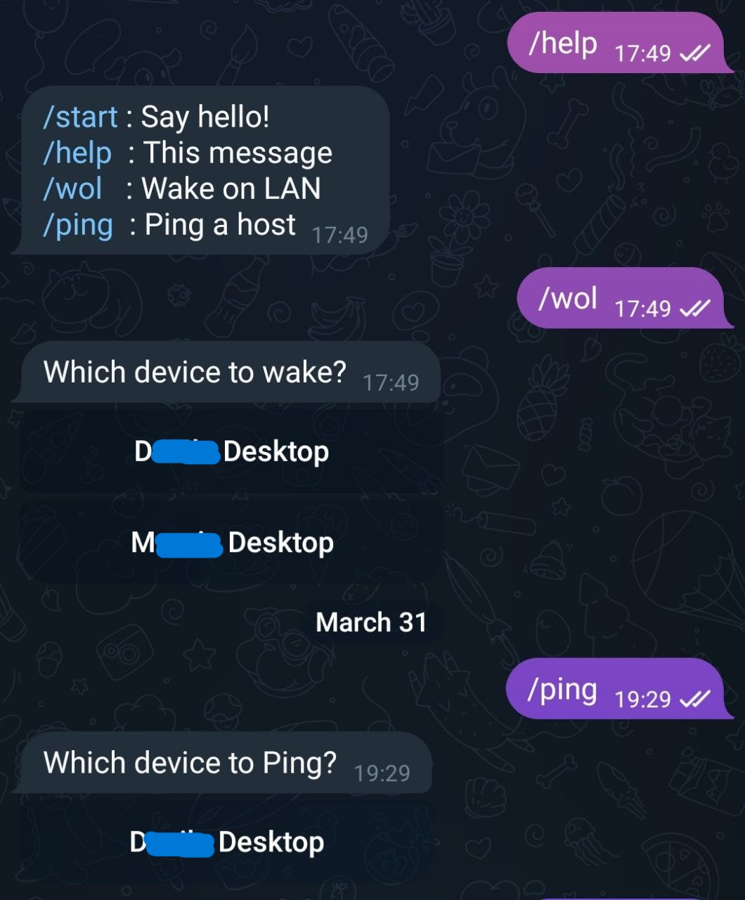

# ESP Telegram Wake On Lan

Turn your PC on from anywhere using Telegram and ESP.

Performs a Wake On Lan (WOL) on a target device. The ESP must be connected to
the same Wi-Fi network as the target device and must
have internet connection to Telegram servers.

This program was tested on the *NodeMCU ESP32-S* and the *D1 mini ESP8266* dev boards, but should work on any ESP.
Just make sure you choose the correct environment on PlatformIO before compiling.
You may need to customise the configuration for your specific dev board.

## Setup

First, make sure your target device supports Wake On Lan.
You may need to enable it in the BIOS and/or your Network Card's Device Manager.
You may also need to disable Windows Fast Startup.

Check this guide for some troubleshooting: https://www.windowscentral.com/software-apps/windows-11/how-to-enable-wake-on-lan-on-windows-11

You should test it with any generic Wake On Lan app for Android or iOS before
attempting to automated it with an ESP.

For pinging, the target computer must have an static IP address.

### Secrets file

Copy src/secrets.example.h to src/secrets.h and replace the values for:

- Wi-Fi network
- Telegram Bot
- Allowed user IDs (Optional, if empty, all users are allowed to use the bot)
- Target device MAC address
- Target device IP address (Optional, for pings, requires static IP)

### Telegram Bot

Create a Telegram bot using [BotFather](https://t.me/botfather) and get the API token.

Get your user ID using [userinfobot](https://t.me/userinfobot) if you don't want anyone to be able to use your bot.

### Development environment

Install Platform.io for VSCode and install dependencies.

You may need to install drivers for the ESP. Mine uses a CP210x USB-to-UART bridge.
You can find the drivers here: https://www.silabs.com/developers/usb-to-uart-bridge-vcp-drivers

Just build the project and upload it to the ESP.
